# Chirp - Project for Database course at AGH UST

A simple social media platform, written in Scala with graph database system.


## Authors

- [Bartosz Rzepa](https://github.com/brzep)
- [Mateusz Marczyk](https://github.com/fantomx775)
- [Wojciech Barczyński](https://github.com/WojciechBarczynski)

## Technologies

- Database: Neo4J
- Backend: Scala

## Vision statement

Social media platform based on Twitter. Main functionality is ment to be adding, displaying posts and interactions between them. Users will be able to tag, comment or react to posts. Their posts recommendations will be based on followed tags/users.

## User stories

As a user I want to add posts in order to tell the world sth. </br>
As a user I want to add tags to created posts in order to specify the target group. </br>
As a user I want to react to posts in order to show my attitude to them. </br>
As a user I want to comment on posts in order to start/participate in meaningful discussions. </br>
As a user I want to react to comments in order to show my attitude to them. </br>
As a user I want to follow other users in order to have their posts recommended. </br>
As a user I want to follow tags in order to have suitable posts recommended. </br>
As a user I want to modify profile info such as bio or photo in order to express myself. </br>
As a user I want to share posts in order to show them to my followers. </br>

## Database schema

### Schema

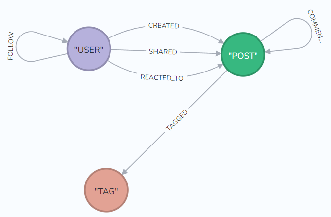

### Relations

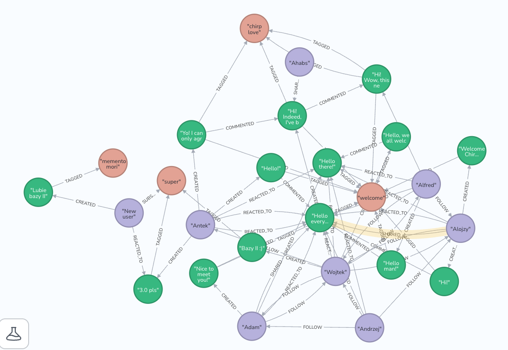

## Backend schema

### Initial schema

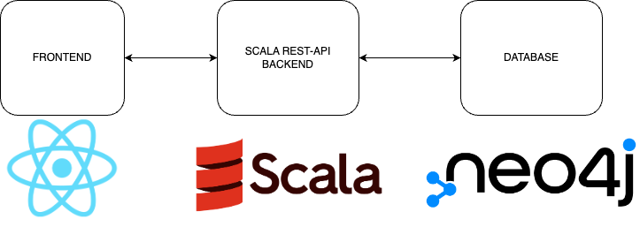

Due to lack of support for scala in Neo4j drivers (there is only one available unofficial driver, that is under development), we changed our schema to:

### Final schema

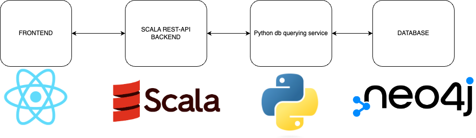

## Recommendation system

Thanks to using graph database, we could easily retrieve most suitable tags and posts.

We rank posts based on:

1. Their invidual reaction engagement score, based on number of rections
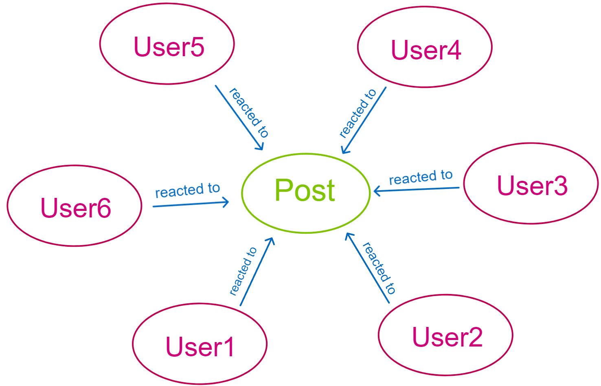
2. User own preferences score:

- Follow users score: posts created and shared by followed users - collaborative filtering
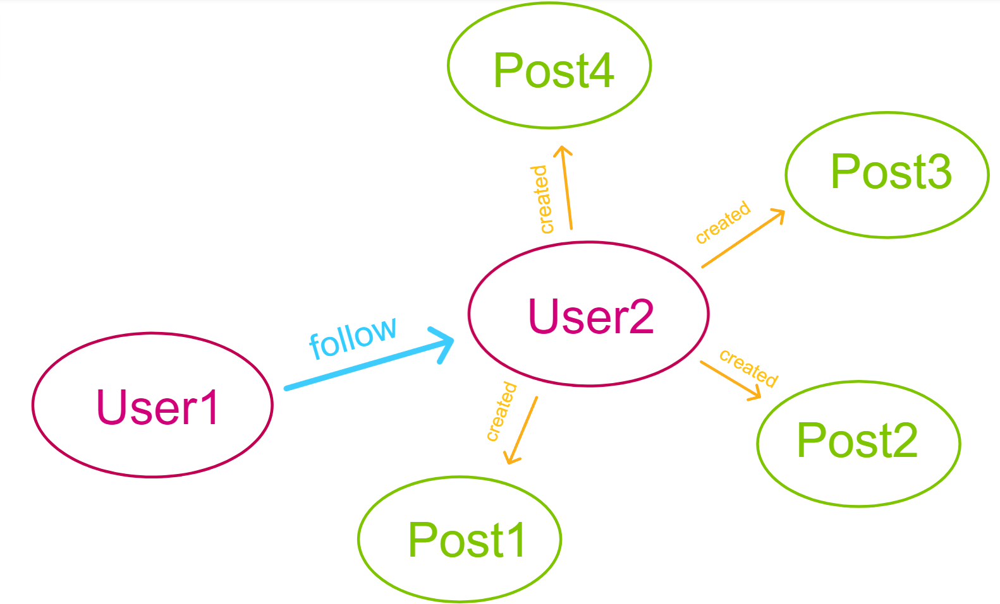
- Subscribed tags score: posts tagged with subscribed tags - content-based filtering
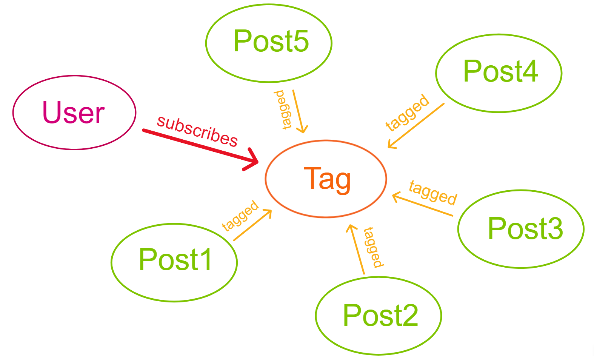

3. Post proximity:
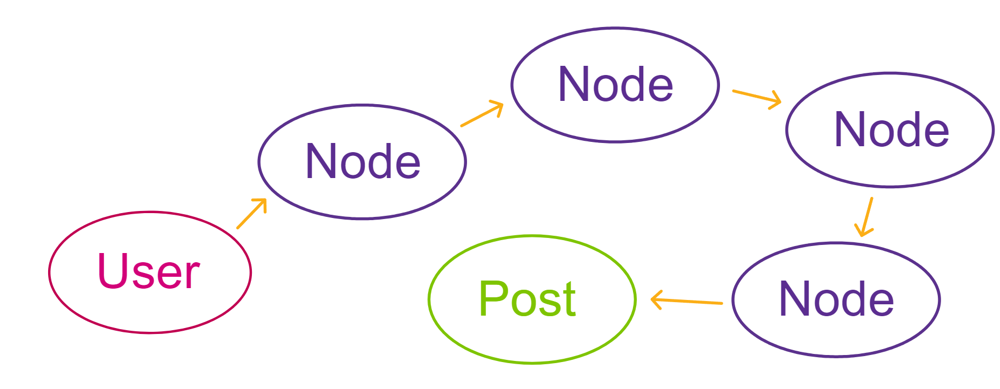

#### Most used tags query

```scala
MATCH (post:POST)-[r:TAGGED]->(tag:TAG) RETURN tag, count(r) ORDER BY count(r) DESC LIMIT 10;
```

#### Followed users posts

```scala
MATCH (follower:USER {name:userName})-[:FOLLOW]->(followed:USER)-[:CREATED]->(post:POST) RETURN post;
```

#### Subscribed tags posts

```scala
MATCH (user:USER {name:userName})-[:SUBSCRIBE]->(tag:TAG)<-[:TAGGED]-(post:POST) RETURN post;
```

#### Post reactions

```scala
MATCH (user:USER)-[r:REACTED_TO]->(post:POST) WHERE ID(post)=postId RETURN count(r);
```

#### Post proximity query

```scala
MATCH (user:USER {name: userName}), (post:POST), path = shortestPath((user)-[*]-(post))
WITH path, post 
WHERE length(path) <= maxDistance
RETURN post
```

#### Commonly followed query
```scala
MATCH (they:USER {name: userName1})-[r:FOLLOW]->(common:USER)
WITH common
MATCH(me: USER {name: userName2}) -[r: FOLLOW]->(common: USER)
RETURN common
```

#### Also followe by query
```scala
MATCH (me:USER {name: myUserName})-[r:FOLLOW]->(them:USER)
WITH them
MATCH (them:USER ) -[r: FOLLOW]->(checked:USER {name: checkedUserName})
RETURN them
````

## Backend endpoints

We created a few endpoints, that allow to:

1. Login user / create new if doesn't exits
```scala
  @cask.post("/login")
  def login(userName: String)
```

2. Create post
```scala
  @cask.post("/post/create")
  def createPost(userName: String, postContent: String, tags: String)
```

3. Comment on post 
```scala
  @cask.post("/post/comment")
  def createComment(userName: String, commentContent: String, tags: String, postId: String)
```

4. Get post comments
```scala
  @cask.get("/post/comments")
  def getComments(postId: String)
```

5. React to post
```scala
  @cask.post("/post/react")
  def react(userName: String, postId: String, reactionType: String)
```

6. Share post
```scala
  @cask.post("/post/share")
  def share(userName: String, postId: String)
```

7. Delete post
```scala
  @cask.post("/post/delete")
  def deletePost(postId: String)
```

8. Update post
```scala
  @cask.post("/post/update")
  def updatePost(userName: String, postId: String, postContent: String)
```

9. Subscribe tag
```scala
  @cask.post("/tag/subscribe")
  def subscribe(userName: String, tagName: String)
```

10. Get recommended tags
```scala
  @cask.get("tag/recommended")
  def recommendedTags()
```

11. Follow user
```scala
  @cask.post("/users/follow")
  def followUser(followerUserName: String, followedUserName: String)
```

12. Get posts recommended for user
```scala
  @cask.get("/users/recommendedPosts")
  def recommendedPosts(userName: String)
```

13. Update bio
```scala
  @cask.post("/users/updateBio")
  def updateBio(userName: String, bio: String)
```

14. Get profiles followed by user
```scala
  @cask.get("/users/followed")
  def followed(userName: String)
```
  
15. Get profiles following user
```scala
  @cask.get("/users/followers")
  def followers(userName: String)
```

16. Get profiles followed commonly by two users
```scala
  @cask.get("/users/commonFollowed")
  def commonFollowed(userName1: String, userName2: String)
```

17. Get profiles also following certain user
```scala
  @cask.get("/users/alsoFollowedBy")
  def alsoFollowedBy(myUserName: String, checkedUserName: String)
```

### Example returns

1. Recommended posts:
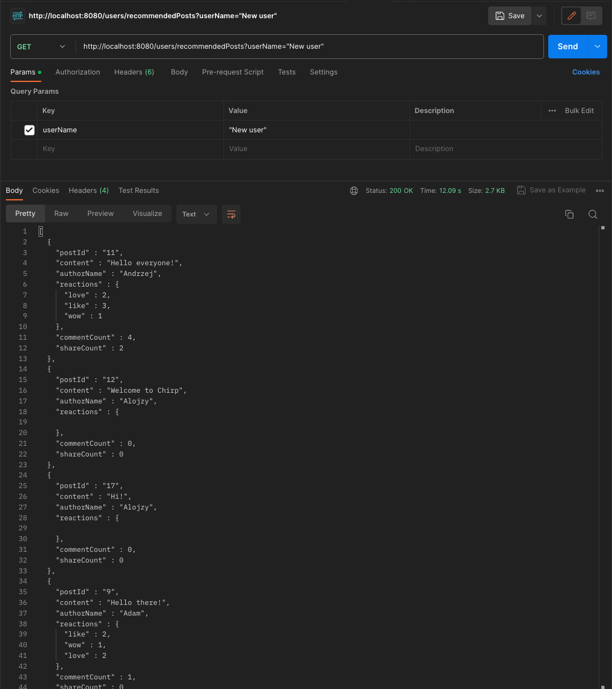

2. Recommended tags:
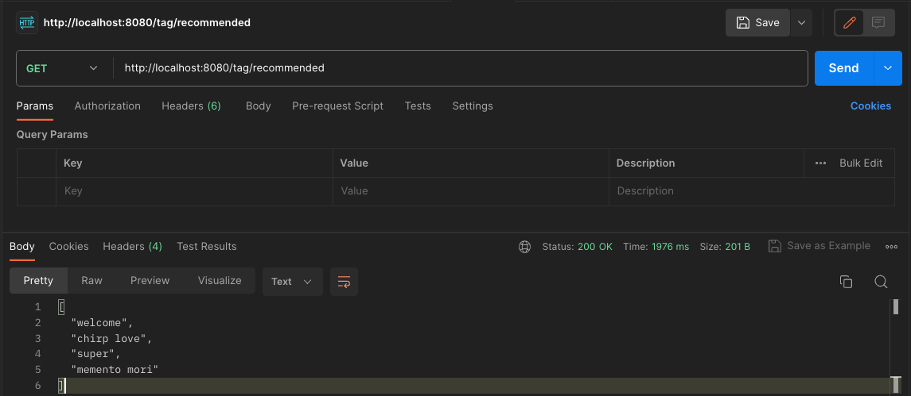

### Frontend

Unfortunately, we haven't finished our frontend/backend integration. We have only created mock frontend without calls to Scala backend.

Here is quick look of how our feed page would look like.

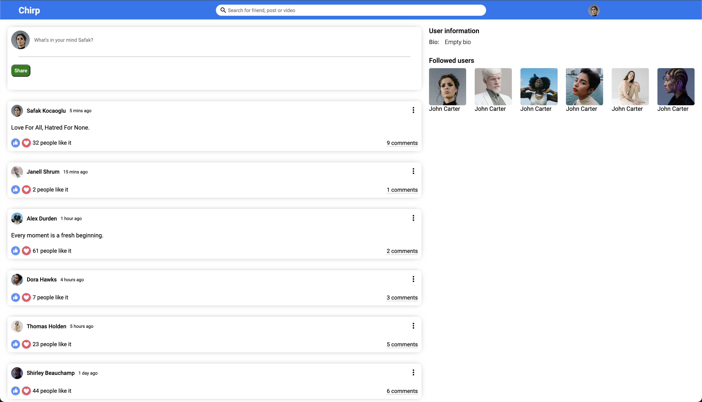
